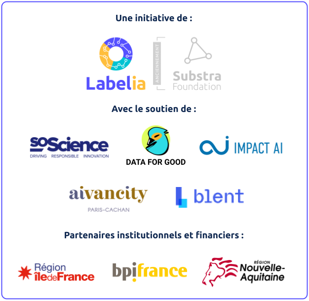
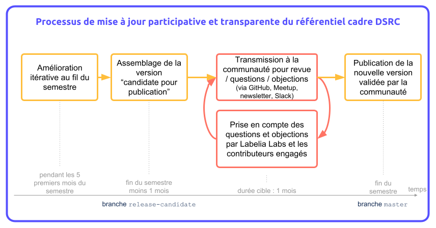
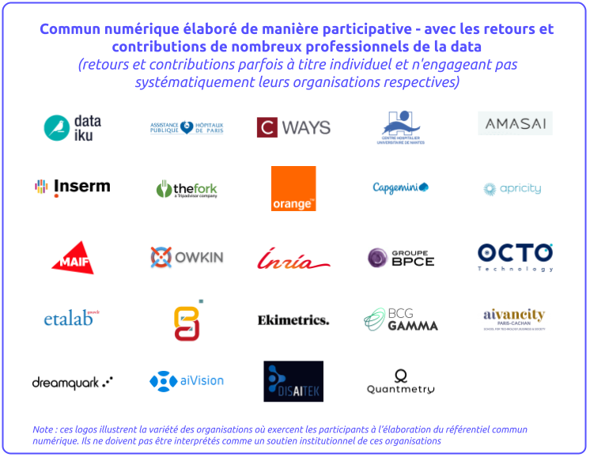

# Data science responsable et de confiance - Référentiel d'évaluation

*Note: although kickstarted in French, this work has been translated in English and will be updated in both languages from January 2021 onwards. Follow [this link](./assessment_framework_eng.md) to access the assessment in English.*

## Résumé rapide

Ce dépôt de fichiers héberge le [référentiel cadre](./referentiel_evaluation.md) de la data science responsable et de confiance (aussi dit *assessment*), élaboré de manière participative dans le cadre de l'initiative du même nom initiée par Labelia Labs (ex- Substra Foundation) en 2019. Il regroupe également les notes des [ateliers-meetups](https://www.meetup.com/fr-FR/data-science-responsable-et-de-confiance/) qui jalonnent cette initiative, co-animés par Labelia Labs (ex- Substra Foundation) et Dataforgood.

Le référentiel est mis à jour officiellement chaque semestre avec une nouvelle version. Les travaux aboutissant à ces mises à jour sont ouverts à tous, ils peuvent être consultés via les *issues* et *PRs* de ce dépôt.

## Navigation dans le repository

`/`  
[`├── README.md`](#contexte-motivations-et-ambition) : [Contexte, motivations et ambition](#contexte-motivations-et-ambition) | [Périmètre du référentiel d'évaluation](#périmètre-du-référentiel-dévaluation) | [Approche participative](#approche-participative)  
**[`├── referentiel_evaluation.md`](./referentiel_evaluation.md)** : **[Référentiel d'évaluation](./referentiel_evaluation.md#référentiel-dévaluation-de-la-maturité-dune-organisation)** | [Risques](./referentiel_evaluation.md#risques)  
[`├── methode.md`](./methode.md) : [Approche](./methode.md#approche-et-méthode-de-consensus) | [Consensus au sein du groupe de travail](./methode.md#consensus-au-sein-du-groupe-de-travail) | [Travaux asynchrones](./methode.md#travaux-asynchrones) | [License](./methode.md#license)  
[`├── references.md`](./references.md) : [Liste de lectures](./references.md#liste-de-lecture) | [Travaux dans ce domaine](./references.md#travaux-dans-ce-domaine)  

## Contexte, motivations et ambition

> *Pour des introductions à cette initiative sous d'autres formes, voir :*
>
> - *[Conférence IA responsable et de confiance](https://www.youtube.com/watch?v=Ip4dCZ8xhEo)* au B-Boost, octobre 2021
> - *[Podcast C-Ways - Mars 2021](https://c-ways.com/datascience-responsable)*
> - *[Blog Labelia Labs (ex- Substra Foundation) - Article d'Eric Boniface, octobre 2020](https://www.labelia.org/fr/blog/evaluation-data-science-responsable)*

Un nouvel espace émerge au croisement entre expansion de l'IA dans les organisations et les systèmes automatiques, et inquiétudes du public sur les données privées, la transparence et la robustesse des algorithmes.

Ce sont deux tendances puissantes qui commencent déjà à se percuter (voir par exemple [le cas Apple Card](https://twitter.com/dhh/status/1192540900393705474) en novembre 2019 ou le formidable article du New York Times en février 2020, [An Algorithm that grants Freedom, or Takes it away](https://www.nytimes.com/2020/02/06/technology/predictive-algorithms-crime.html)). Comment les réconcilier, les conjuguer ensemble ? Des solutions techniques et organisationnelles nouvelles sont indispensables pour cela, pour accorder un cadre de confiance qui manque aujourd’hui, pour rendre possible des collaborations nouvelles, prometteuses et sûres entre les entreprises, les institutions publiques et les citoyens.

De nombreux acteurs s'emparent du sujet et travaillent par exemple déjà à des cadres pour un usage à impact positif des technologies d'IA, à des outils pour apporter de la traçabilité aux travaux de data science, à des formations pour éviter la reproduction de biais discriminatoires, à des briques techniques pour permettre la mutualisation et renforcer la confidentialité des données, etc.

En s'appuyant sur les travaux, cadres et corpus existants, **nous travaillons de manière ouverte et collaborative** à la définition de la **data science responsable et de confiance** et à l'élaboration d'un **référentiel cadre commun open source** de bonnes pratiques permettant aux organisations intéressées d'évaluer leur niveau de maturité.

### Une initiative de plus ?

Pourquoi cette initiative, dans un univers qui voyait déjà en 2019, et voit encore plus aujourd'hui, émerger un certain nombre de travaux ? Nous tenons à jour [une liste de travaux](./references.md#travaux-dans-ce-domaine) que nous avons identifiés. Ils sont tous intéressants, inspirants, utiles. Beaucoup proposent des _guidelines_, des chartes, des engagements à prendre, traitent de l'éthique de l'usage de technologies d'IA. Certains explorent des voies nouvelles : licences spécifiques aux modèles d'IA, plateforme d'analyse de risque... Mais à ce stade aucun ne nous a semblé répondre aux deux exigences suivantes :

1. porter sur toute **l'activité data science d'une organisation** (comme ensemble de pratiques, de processus, de méthodes...), par opposition à porter sur l'élaboration d'un modèle/système d'IA ou le pilotage d'un projet ;

1. être fait **pour être utilisé comme un outil concret d'évaluation** de la maturité de l'organisation.

Nous imaginons un référentiel qui soit actionnable, opérationnel, pour que cela puisse être utile le plus rapidement possible et, à l'usage, susciter des réflexions, des échanges, des souhaits d'amélioration. Qu'il puisse faciliter l'émergence d'offres d'évaluation, audit, formation dans ce domaine.  
Nous pensons que la communauté data science responsable et de confiance en France et en Europe pourrait bénéficier d'un tel cadre commun. L'enjeu est de fournir des repères pour augmenter la lisibilité du sujet et de le faire connaître le plus largement possible, de faciliter la montée en maturité des organisations, les nouvelles collaborations entre prestataires spécialisés et grandes organisations... L'enjeu est aussi d'animer une dynamique d'échanges au sein de la communauté et d'amélioration continue du référentiel lui-même.

### Pourquoi _responsable_ et _de confiance_, et pourquoi pas _éthique_ ?

Nous utilisons ici ces termes comme suit :

_Responsable_ : Qui se préoccupe des conséquences sur ses parties prenantes, cherche à avoir un impact positif, essaie d'éviter d'être _irresponsable_ c'est-à-dire ne pas maîtriser des conséquences préjudiciables pour ses parties prenantes.

_De confiance_ : Dans lequel on peut avoir un niveau de confiance raisonnable car les règles de l'art prévenant une large panoplie de risques typiques sont appliquées.

Les deux notions se recouvrent en partie. Il est cependant difficile de trouver un terme unique satisfaisant. La combinaison des deux apporte une richesse qui nous semble utile.

On considère ici la _data science_ comme une combinaison de techniques et d'outils. Dans ce contexte l'_éthique_ de la data science ou de l'intelligence artificielle ne nous semble pas être le meilleur angle pour aborder et étudier les questions et défis inhérents à la data science dans le but d'élaborer un référentiel opérationnel. L'angle éthique polarise la réflexion sur les usages de l'IA, et la fond dans celle de l'éthique de l'usage des technologies ou des capacités techniques de manière plus générale (voir par exemple [cet article de Tom Chatfield sur OneZero](https://onezero.medium.com/theres-no-such-thing-as-ethical-a-i-38891899261d)). Il s'agit cependant d'un excellent sujet de discussion et débat, la conversation est donc très ouverte en ce moment dans la communauté.

Par ailleurs, une [discussion est ouverte](https://github.com/SubstraFoundation/referentiel-ds-responsable-confiance/issues/23) sur ce sujet pour prolonger la réflexion.

## Périmètre du référentiel d'évaluation

### Un référentiel d'évaluation qui s'adresse à qui ?

- Cible principale : **l'activité data science d'une organisation**
- Hors-cible : un projet donné, un produit donné, un modèle prédictif donné
- Pourquoi ?
  - Les projets et produits peuvent prendre des formes extrêmement variées et il est donc très difficile d'être pertinent avec un référentiel générique
  - L'effort pour s'évaluer selon un référentiel peut être trop élevé s'il doit être fait projet par projet
  - Les mesures ou pratiques relatives aux collaborateurs (e.g. les formations) correspondent plus naturellement aux pratiques d'une organisation qu'à celle d'un projet donné
- Idées d'élargissements possibles : des mesures plus ciblées visant un projet en particulier pourraient être étudiées.

### Que désigne-t-on par _IA_ et _data science_ ?

- Cible : **les modèles d'IA et les systèmes automatiques résultant de l'utilisation de techniques algorithmiques sur des données**. On prend ici une acception large des termes _IA_ et _data science_ (e.g. on y inclut les systèmes experts).
- Hors cible : les systèmes informatiques, la sécurité informatique, la gestion des bases de données en général (même si toutefois, en se concentrant sur l'activité data science d'une organisation, des sujets de sécurité et de gestion des données émergeront naturellement).

## Approche participative

### Cycle d'ateliers d'échange et de co-construction

Nous proposons de travailler de manière ouverte et collaborative et organisons pour cela des ateliers d'échange et de co-construction. L'inscription est gratuite et sans engagement, via la plateforme Meetup ([lien](https://www.meetup.com/fr-FR/data-science-responsable-et-de-confiance/)).

#### Saison 1

- Atelier #1 : mercredi 18 décembre 2019 à la Maison du Libre et des Communs (Paris) - [notes de l'atelier](./workshops-notes/2019.12.18_workshop-1_notes.md)
- Atelier #2 : jeudi 6 février 2020 à la Maison du Libre et des Communs (Paris) - [notes de l'atelier](./workshops-notes/2020.02.06_workshop-2_notes.md)
- Atelier #3 : jeudi 2 avril 2020 par téléconférence - [notes de l'atelier](./workshops-notes/2020.04.02_workshop-3_notes.md)
- Atelier #4 : mardi 23 juin 2020 par téléconférence - [notes de l'atelier](./workshops-notes/2020.06.23_workshop-4_notes.md)
- Atelier #5 : mardi 8 septembre 2020 par téléconférence - [notes de l'atelier](./workshops-notes/2020.09.08_workshop-5_notes.md)
- Atelier #6 : mardi 10 novembre 2020 par téléconférence - [notes de l'atelier](./workshops-notes/2020.11.10_workshop-6_notes.md)
- Atelier #7 : mardi 15 décembre 2020 par téléconférence - [notes de l'atelier](./workshops-notes/2020.12.16_workshop-7_notes.md)

#### Saison 2 - co-organisée avec Dataforgood

- Atelier/Meetup #1 : lundi 22 février 2021 par téléconférence - [notes de l'atelier](./workshops-notes/2021.02.22_workshop-s02e01_notes.md)
- Atelier/Meetup #2 : lundi 26 avril 2021 par téléconférence - [notes de l'atelier](./workshops-notes/2021.04.26_workshop-s02e02_notes.md)
- Atelier/Meetup #3 : lundi 21 juin 2021 par téléconférence - [notes de l'atelier](./workshops-notes/2021.06.21_workshop-s02e03_notes.md)
- Atelier/Meetup #4 : lundi 20 septembre 2021 par téléconférence - [notes de l'atelier](./workshops-notes/2021.09.20_workshop-s02e04_notes.md)
- Atelier/Meetup #5 : lundi 22 novembre 2021 par téléconférence - [notes de l'atelier](./workshops-notes\2021.11.22_workshop-s02e05_notes.md)

#### Saison 3 - co-organisée avec Dataforgood et la FING

- Meetup #1 : lundi 7 mars 2022 à 17h ([lien d'inscription](https://www.meetup.com/fr-FR/data-science-responsable-et-de-confiance/))
- Meetup #2 : lundi 9 mai 2022 à 17h
- Meetup #3 : lundi 20 juin 2022 à 17h
- Meetup #4 : lundi 19 septembre 2022 à 17h
- Meetup #5 : lundi 21 novembre 2022 à 17h

Curieux ? Enthousiaste ? Sceptique ? Essayons ensemble, avec toutes les bonnes énergies de celles et ceux qui sont intéressés par le sujet et la démarche, avec l'esprit ouvert à la possibilité que cette démarche puisse muter, rencontrer d’autres initiatives… avec la certitude cependant d'échanger et d'apprendre sur des sujets passionnants.

### Responsabilité éditoriale, disponibilité en ligne des travaux et participation asynchrone

Ce travail est élaboré sous la responsabilité éditoriale de l'association à but non lucratif Labelia Labs (ex- Substra Foundation), qui s'engage à le mettre à disposition de manière à ce qu'il puisse être librement reproduit et partagé.

Ainsi, le projet en ligne et le dépôt de fichiers associés, hébergés par Labelia Labs (ex- Substra Foundation) sur GitHub, assurent la disponibilité en ligne de ces travaux et du référentiel de la data science responsable et de confiance. Au-delà des ateliers participatifs bimestriels, il est donc également possible de participer de manière asynchrone.

### Nature évolutive

Par nature cette démarche est en constante évolution. Il nous semble plus utile et plus transparent de mettre à disposition le référentiel dans son état du moment, plutôt que d'attendre le franchissement de jalons majeurs. Ainsi, chacun est en mesure d'en prendre connaissance et de participer par des questions ou des suggestions d'amélioration.
Un versionnage officiel est proposé en complément afin de fournir un repère temporel aux organisations utilisatrices.

### Processus de supervision et validation des mises à jour du référentiel cadre

Afin d'assurer la transparence et la sincérité de l'élaboration participative du référentiel cadre de la data science responsable et de confiance, le processus décrit sur le schéma ci-dessous est mis en place.

Le travail itératif pour améliorer le référentiel se déroule tout au long de l'année, mais les mises à jour officielles du référentiel ne sont entérinées qu'une fois par semestre. Pour celles-ci, la version candidate pour mise à jour, composée de toutes les contributions des premiers mois du semestre, sont transmises pro-activement à la communauté (suiveurs de ce repository, inscrits au Meetup, abonnés au Slack, inscrits à la mailing list). Toutes les questions, remarques, propositions et objections sont traitées en toute transparence via les issues et PRs sur ce repository. Le comité de gouvernance s'en assure en observant les interactions sur les issues et PRs. La version candidate pour mise à jour est ainsi affinée pour faire consensus, et entérinée une fois tous les retours traités et le consensus assuré.

Le comité de gouvernance est composé de professionnels de la data science et du numérique, avec une diversité d'expériences et de savoir-faire (public et privé, spécialistes techniques et responsables de projets, industrie et recherche). Il est composé de 7 à 10 membres y siégeant à titre individuel, et sera renouvelé annuellement.

### Elaboration participative, contributions et retours - Remerciements

Nous remercions tous les contributeurs de près ou de loin à ce commun numérique, qui, par leurs questions lors des ateliers, par les articles ou outils qu'ils ont suggérés, par les critiques et suggestions qu'ils ont faites à partir de l'assessment, par leurs contributions directes à la rédaction de certains points, ont façonné et façonnent encore le référentiel cadre de la data science responsable et de confiance.

### Mise à disposition

 Ce(tte) œuvre est mise à disposition selon les termes de la <a rel="license" href="http://creativecommons.org/licenses/by-nc-nd/4.0/">Licence Creative Commons Attribution - Pas d&#39;Utilisation Commerciale - Pas de Modification 4.0 International</a>.
